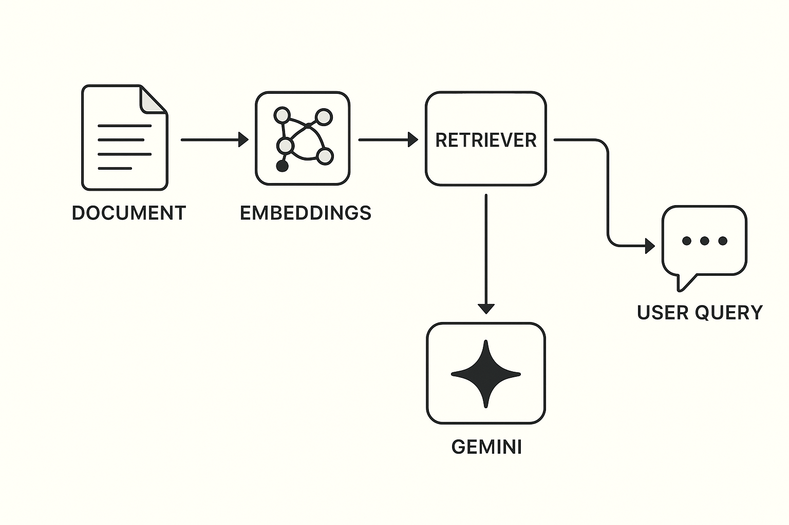

# AskMyPDF

AskMyPDF is a simple app that lets you talk to your PDF files. 
Just upload one or more PDFs, ask a question in plain English, and the app will give you the answer. 
It works by reading the content of your PDFs, finding the most relevant parts, and then using Google Gemini 2.5 Flash AI to generate accurate answers. 
No more scrolling through hundreds of pages – just ask and get what you need!

---

## 🚀 Features
 - �️ **Chat History Storage with Supabase** – All chat history is stored securely in Supabase, allowing for persistent, cloud-based access and management.  
 - �‍🎤 **Persona-based Output** – Use `output_behavioural.py` to customize answer style (e.g., lawyer, teacher, researcher, student) for more relevant and engaging responses.

---

## 🛠️ Tech Stack
| Technology            | Why it’s used |
|------------------------|------------------------------------------------------------------|
| **Python**             | Core language for building the app, chosen for its simplicity and rich AI ecosystem. |
| **Streamlit**          | Provides an interactive and minimal UI to upload PDFs and chat in real-time without needing complex frontend code. |
| **LangChain**          | Handles text chunking, embeddings, and question-answer chains, making it easier to connect LLMs with PDF data. |
| **PyPDF / pdfplumber** | Extracts text from PDF files, ensuring even scanned/complex documents can be parsed. |
| **FAISS**              | Vector database used to efficiently store and search embeddings across multiple PDFs. |
| **Google Gemini 2.5 Flash** | The LLM backend that generates accurate, context-aware answers quickly. |
 | **Supabase**           | Cloud database for storing chat history, enabling multi-user support and persistent conversations. |
 | **output_behavioural.py** | Defines persona-based prompt templates for tailored answer styles. |

---

## ⚙️ How it Works (RAG Pipeline)
AskMyPDF uses a **Retrieval-Augmented Generation (RAG)** approach:

1. **PDF Ingestion** – Extract text from PDFs and split into smaller chunks.  
2. **Embeddings** – Convert text chunks into numerical vectors using HuggingFace `all-MiniLM-L6-v2`.  
3. **Vector Store (FAISS)** – Store and retrieve the most relevant chunks based on the user’s query.  
4. **LLM (Gemini 2.5 Flash)** – The retrieved context and the user’s question are sent to Google Gemini, which generates a clear and contextual answer.  

🔗 This ensures answers are **grounded in your PDFs** instead of hallucinated.

📊 **Architecture Diagram**  
<p align="center">
  
</p>


➡️ **RAG Flow:**  
```
[User Query] → [Retriever (FAISS + embeddings)] → [Gemini LLM] → [Answer]
```

---

## 🎥 Demo
Here’s a quick demo of AskMyPDF in action:

<p align="center">
  
</p>


---

## 🚦 Getting Started
### 1. Clone the Repository
```bash
   git clone https://github.com/harshaadeshmukh/AskMyPDF.git
   cd AskMyPDF
```

### 2. Set Up the Environment:
```bash
python -m venv venv
source venv/bin/activate  # On Windows, use `venv\Scripts\activate`
```

### 3. Install dependencies:
```bash
pip install -r requirements.txt
```

### 4. Add your Gemini API key in config.py.

### 5. Run the app:
```bash
streamlit run home.py
```

### 6. Upload a PDF (or multiple PDFs) and start asking questions!

---

## 📂 Directory Structure
```
AskMyPDF/
│
├── home.py           # Website landing page (opens first when you visit)
├── app.py            # Chatbot app (upload PDFs, ask questions, get answers)
 ├── config.py         # Stores API keys, Supabase credentials for chat history
 ├── output_behavioural.py   # Persona-based prompt templates for answer customization
├── requirements.txt  # List of Python dependencies
└── assets/           # Folder for images, diagrams, and other static resources
    └── rag_flow.png  # RAG architecture diagram
    └── demo.gif      # Demo video of the chatbot
```

---

## 🎯 Use Cases

📘 Students & Researchers – Summarize and query research papers, theses, or eBooks.  

📑 Professionals – Quickly extract insights from lengthy business reports, contracts, or manuals.  

📊 Data Analysts – Get fast answers from documentation, guidelines, or case studies.  

📚 General Readers – Turn any long PDF into an interactive knowledge assistant.
